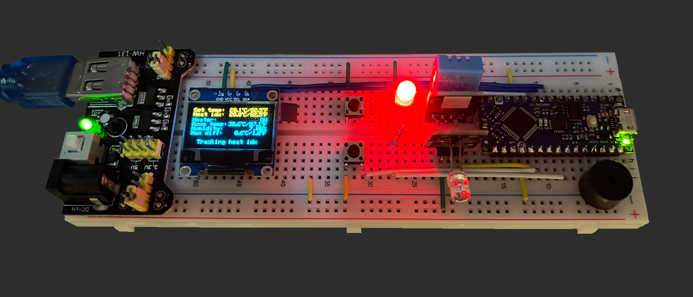
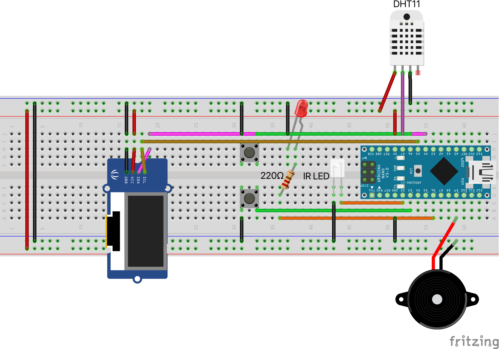

# Thermostat

A cloud-capable Arduino thermostat using IR remote to control a heater.

## Parts

* Arduino Nano Every (non-cloud) / Arduino Nano 33 IoT (cloud-capable)
* UCTRONICS 0.96 Inch OLED Module, 128x64, I2C
* Adafruit DHT11 temperature & humidity sensor
* IR LED as heater remote
* LED as heater status indicator
* Active buzzer as heater toggle sound feedback

## Connections

